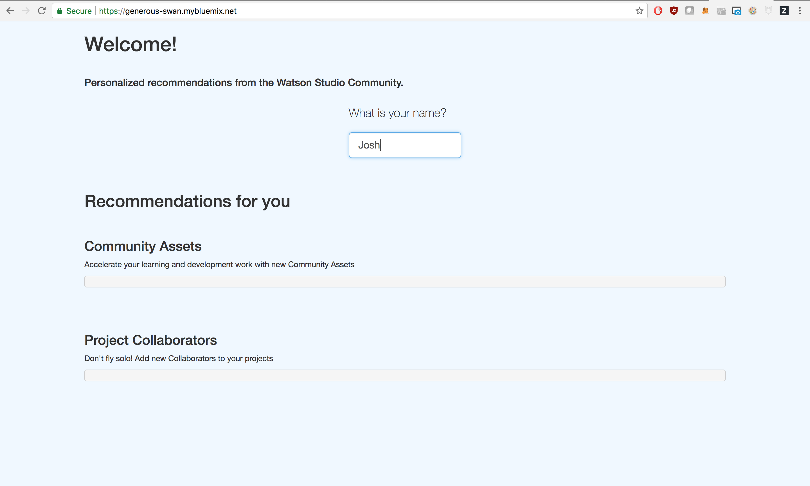

# UdacityCollaboration

This respository contains detailed instructions for the [IBM Watson](https://www.ibm.com/cloud/watson-studio) and [Udacity Data Science Nanodegree (DSND) ](https://www.udacity.com/course/data-scientist-nanodegree--nd025) collaboration. 

We'll build a sample application which serves Community Content recommendations to Watson Studio users. Find an example here: http://generous-swan.mybluemix.net/

## Motivation

This project will provide students the opportunity to work with real world data from a rapidly growing software product at IBM and the insight into how we at Watson Studio approach these challenges with modern tools and frameworks, including python, Flask, Spark, and machine learning. 

**The Challenge**

In order help our users be more productive, we need to assist them in finding both the resources and the people that they need to succeed. 

[The Community](https://dataplatform.ibm.com/community?context=analytics) contains data sets, articles, notebooks, tutorials, and more which make it easy to get started working on tough projects by incorporating on the breadth of assets curated by IBM and Watson Studio Community. We'll build a Recommendation System that will recommend these assets to users based on similar users' selections. 

The second component is people. At a large company like IBM, an important part of success involves finding the right collaborators for your team. In this project, we'll recommend collaborators to users so that they can grow their network and build the right teams for their projects. 

Our application should solve both of these challenges by providing a user personalized recommendations for Community Content and Project Collaborators. The app should have simple front-end that looks like this:

Where we'll ask the user for their name and then return the recommended Project collaborators and Community Assets. 

## Get Started

* [Signing up for Watson Studio](./signup)

* [Building a Recommendation Engine with Notebooks and Watson Machine Learning](./watson-studio)

* [Deploying a simple python Flask app with IBM Cloud](./app)

