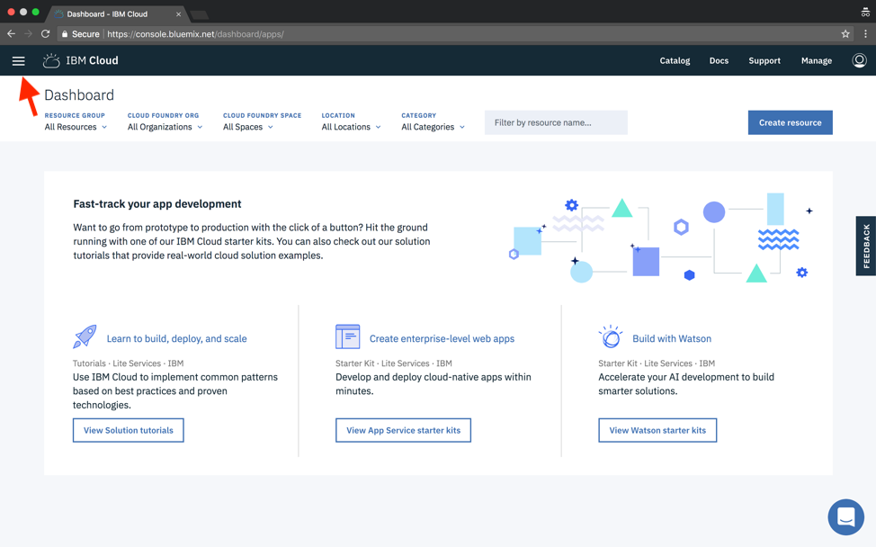
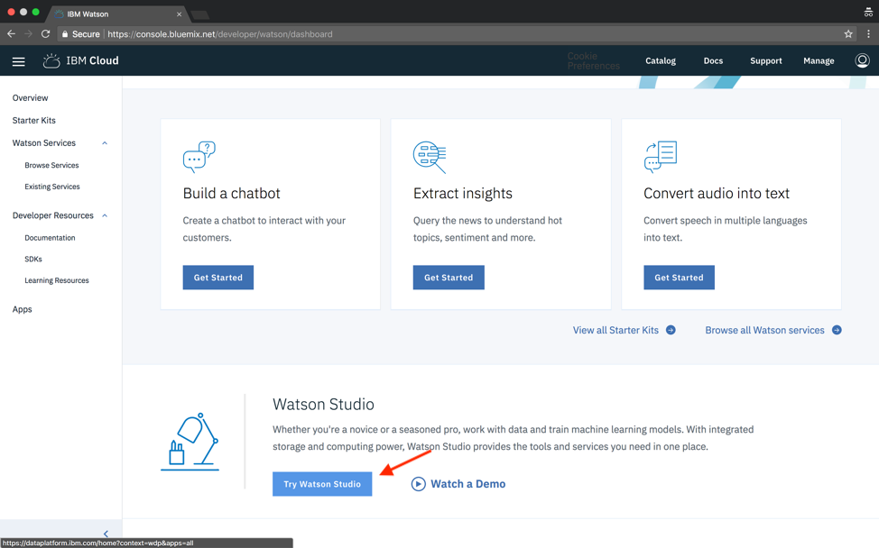
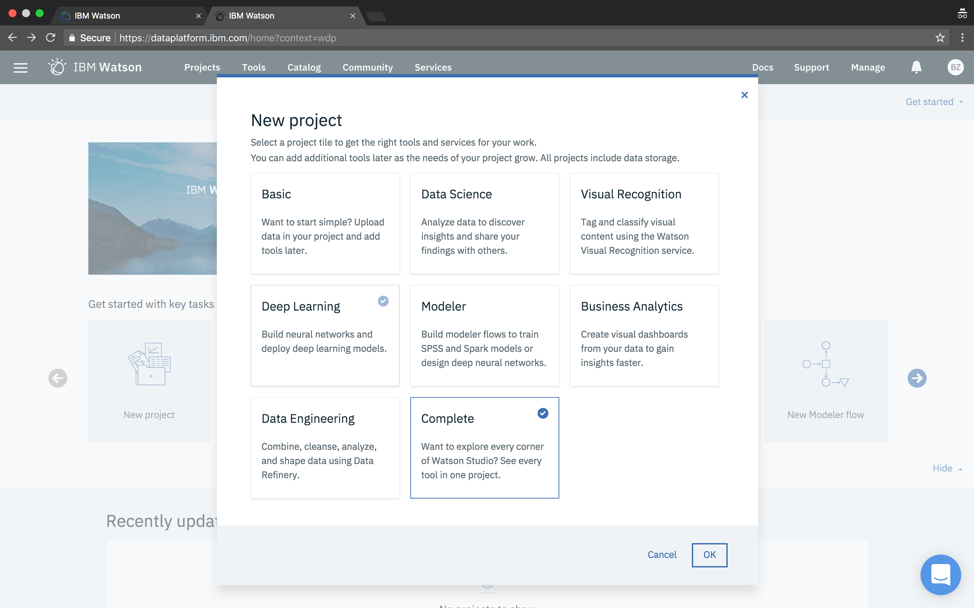
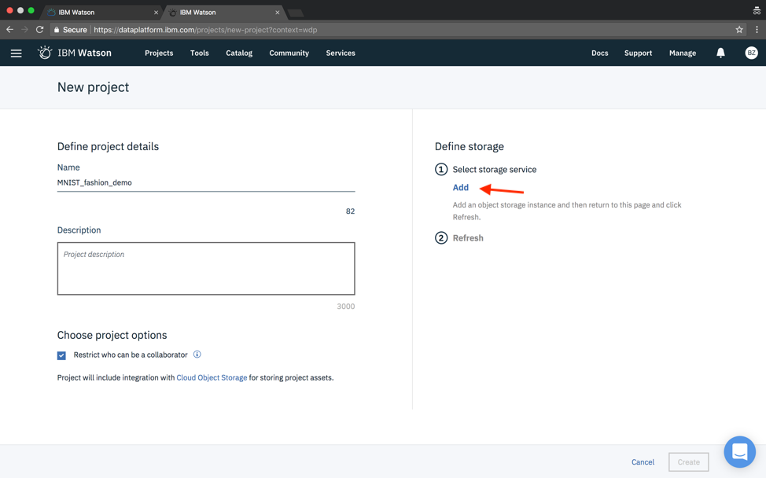

### Get Started

[Watson Studio](https://datascience.ibm.com/docs/content/getting-started/signup-wdp.html?context=analytics) provides a suite of tools for data scientists, application developers, and subject matter experts to collaboratively and easily work with data and to use that data to build, train and deploy models at scale. We'll use Watson Studio along with other free services from the [IBM Cloud](https://console.bluemix.net/) to build a [python Flask](http://flask.pocoo.org/) web application with a simple HTML and JavaScript User Interface which asks the user for their name and returns recommended content from the [Watson Studio Community](https://datascience.ibm.com/community)

Building a recommendation system is more than just fitting a model -- we need to understand how our users might interact with the recommendations and how other systems will consume and display the results from our model. This project will extend your knowledge of recommendations systems and to consider the challenges that might arise after you've developed your model. 

_______________

## Tools

To get started, you'll need a few tools. 

* An [IBM Cloud Account](https://console.bluemix.net/)

* A [Watson Studio Account](https://console.bluemix.net/catalog/services/watson-studio)

* An Instance of [Watson Machine Learning](https://console.bluemix.net/catalog/services/machine-learning)

* An Instance of [Spark Service](https://console.bluemix.net/catalog/services/apache-spark)

All of these are free to use with the `Lite` plan. We will cover signing up and configuring the services in this guide. 

__________

## IBM Cloud

First, we'll need a free IBM cloud account at bluemix.net and then log in. The console looks like this:

The reason why we should start from an IBM cloud account is that the Watson Studio is a product based on the IBM cloud. 

<...>

Now let's click Menu at top left and select Watson

Scroll down a little bit and click "Try Watson Studio"

Click "Continue"

Click "Get Started"

The page jumps to Watson Studio Dashboard

### Create new project
On the dashboard, click "New Project", choose “Complete” and click "OK"

Type in a project name and click “Add” on left (Select storage service)

Scroll down, choose Lite (free) and click "Create"

Click "Confirm".

The storage service is very common nowadays. We need this cloud storage to store our data, our model and literally everything relates to our project in Watson Studio. (It's free! 25G!)

After confirming, click “Refresh” in the “Define Storage” panel and then click “Create”

The page jumps to project dashboard

### Add machine learning service to project
Click on "Setting" tab, scroll down to "Associated Service", click "Add service" and select "Machine Learning". (We need to associate instances of services with projects in order to get the most out of them in Watson Studio)

Choose the Lite (free) version and confirm

Repeat for Spark. 

